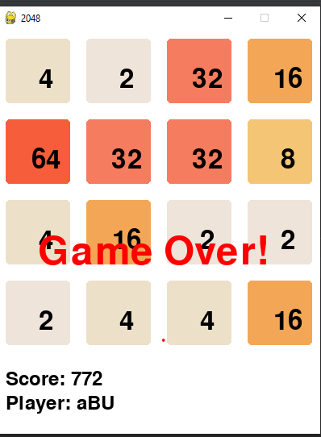

# 2048 Game in Python (Pygame)

## Overview

This is an implementation of the popular 2048 game using the Python **Pygame** library. The game is a sliding puzzle where the objective is to combine tiles with the same number to create a tile with the value **2048** or higher. The game is visually enhanced with a GUI, animations, and additional features to improve gameplay.

---

## Features

1. **Graphical User Interface (GUI)**:
   - Visually appealing grid and tiles created using Pygame.
   - Responsive design for smooth interaction.

2. **Scoring System**:
   - Track your current score as you play.
   - Save scores to a leaderboard to encourage replayability.

3. **Undo Feature**:
   - Allows players to undo their last move to recover from mistakes.

4. **Animations**:
   - Smooth animations for tile movements and merging using Pygame's `time.Clock`.

5. **Difficulty Levels**:
   - Choose between Easy, Medium, Hard, and Expert difficulty levels.
   - Starting configurations vary by difficulty, with added challenges for advanced players.

6. **Improved Visuals**:
   - Tile shadows and gradients for a polished design.
   - Enhanced visual feedback for merging tiles.

---

## Installation

### Prerequisites
- Python 3.7+
- Pygame library

### Steps to Install

1. Clone the repository:
   ```bash
   git clone https://github.com/jamilmrt/Python-Programming-Intern/tree/main/gameWithGUIPython
   cd gameWithGUIPython
   ```

2. Install the required dependencies:
   ```bash
   pip install -r requirements.txt
   ```

3. Run the game:
   ```bash
   python main.py
   ```
---
# Game Gui

  

---

## How to Play

1. **Start the Game**:
   - Run the `main.py` file to start the game.
   - Choose your desired difficulty level from the menu.

2. **Game Controls**:
   - Use the **Arrow Keys** to move tiles:
     - **Up Arrow**: Slide tiles up.
     - **Down Arrow**: Slide tiles down.
     - **Left Arrow**: Slide tiles left.
     - **Right Arrow**: Slide tiles right.
   - Press **U** to undo your last move.

3. **Objective**:
   - Combine tiles with the same number to create a tile with the value **2048** or higher.
   - Avoid filling the grid, as it ends the game.

4. **Leaderboard**:
   - At the end of the game, your score is saved and displayed in the leaderboard.

---

## File Structure

---
```
.
├── main.py          # Main script to run the game
├── leaderboard.txt  # Stores leaderboard scores
├── main.text.py     # This is a testing file where i have done my code 
└── README.md        # This file
```

---

## Future Enhancements

1. **Online Leaderboard**:
   - Implement an online leaderboard to compare scores with other players globally.

2. **Themed Skins**:
   - Add customizable skins for tiles and background.

3. **Power-Ups**:
   - Introduce power-ups like doubling a tile or clearing a row.

4. **Multiplayer Mode**:
   - Add a local or online multiplayer mode to compete with friends.

---


## Acknowledgments

- Inspired by the original **2048 Game** created by **Jamil Aktar**
- Built using the **Pygame** library.

---

Enjoy playing the game and have fun! 🎮
